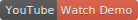
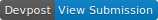
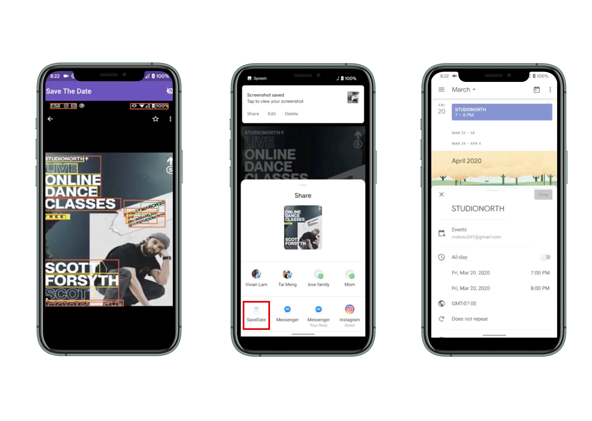

# Save The Date

[](https://www.youtube.com/watch?v=pDBKZgbR0xk) [](hhttps://devpost.com/software/save-the-date-dql1fr)

Add events to your calendar just by taking screenshots! Created by [Nick Wu](https://nickwu241.github.io) and Vivian Lam.

**Problem**: When I see a cool event on Instagram/online, it takes a lot of effort to add it into my calendar as a reminder. :(

**Solution**: It's smoother to just take a screenshot and have the event added to your calendar, and that's what we did! ^_^

**How does it work?**

1. User sees an event / message on phone or poster
2. Take a screenshot or photo
3. Share that photo with our app Save The Date
4. Event gets added to your calendar!



## Developing

Application code lives in `lib` where `main.dart` is the entry point.

[Install Flutter](https://flutter.dev/docs/get-started/install) if you haven't and you should be able to run our app after!

```bash
flutter run
```

### Directory Structure

```bash
.
├── android # Android specific configurations
├── assets  # Static assets (icons, images)
├── ios     # iOS specific configurations
├── lib     # Application code
│   ├── add_to_calendar.dart     # Logic for creating calendar events
│   ├── handle_share_intent.dart # Logic for handling share intents of images from the OS
│   ├── main.dart                # Entry point to start the app
│   ├── models.dart              # Data models
│   ├── parse_image_file.dart    # Logic for parsing out a CalendarEvent from an image
│   ├── parse_text.dart          # Helper used in parse_image_file.dart
│   └── widgets # Screens and Reusable Widgets
│       ├── onboarding_widget.dart
│       └── text_detector_painter.dart
└── test # Testing code
```

## Icon Credits

The 3 icons from the onboarding screen are from [Icons8](https://icons8.com/).
